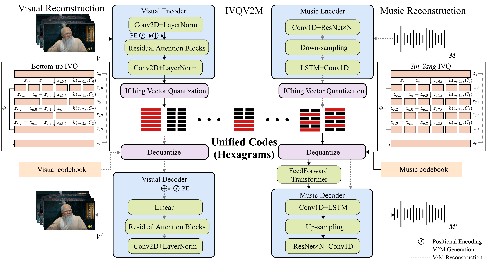

## IVQ: Structured and Lightweight Vector Quantization via Binary Hierarchical Composition Inspired by *IChing*



### 1. Environment Preparation

Please first clone the repo and install the required environment (refer to ```./vision_part``` and ```./music_part```)


### 2. Training and Inference
Please refer to ```./vision_part``` and ```./music_part```


### 3. Model weights

The pretrained model's parameter weights have been published and can be accessed at [here](https://huggingface.co/chouliu/IVQ/tree/main).

### 4. Acknowledgements

you may refer to related work that serves as foundations for our framework and code repository, TiTok, GVMGen. Thanks for their wonderful works.

### 5. Citation
```
@inproceedings{zuo2026IVQ,
        title={IVQ: Structured and Lightweight Vector Quantization via Binary Hierarchical Composition Inspired by IChing},
        author={Zuo, Heda and Wu, Junxian and Lu, Fengjie and Chen, Pei and Sun, Lingyun and You, Weitao },
        booktitle={International Conference on Machine Learning},
        year={2026}
    }
```
